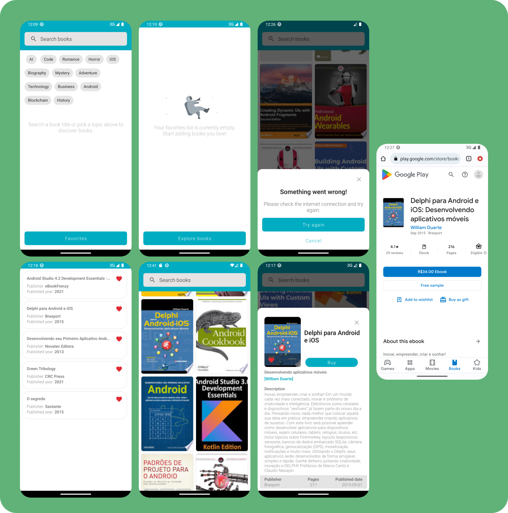
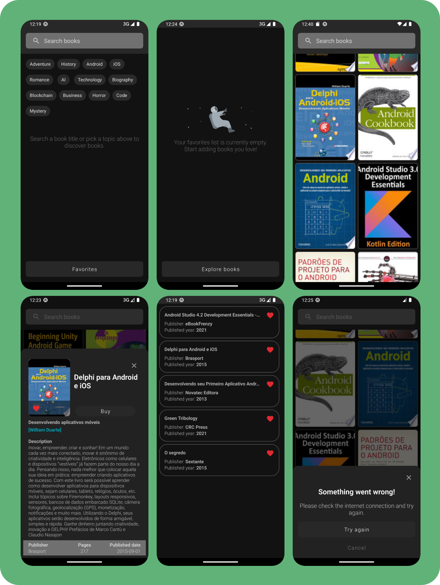

# Bookshelf
A project challenge to build an Android app for book exploration and favoriting, powered by the Google Books API.

# Mobile Development

This application showcases a simple 2-column list of available books related to mobile development. It leverages Google's Book API to fetch and display book thumbnails. The app loads more books as the user scrolls through the list, providing a seamless and intuitive user experience.

## Features

- **Infinite scrolling list:** The app utilizes Paging 3 to fetch and display books in an efficient and user-friendly manner.

- **Book details:** On clicking a book, the app presents a detailed view with key information about the book, including the title, author, description, and a buy link (when available).

- **Favorite books:** Users can mark books as favorites. These choices are stored locally and persist across app usage. Additionally, users can filter the list to show only their favorite books.

- **Buy link:** The buy link redirects the user to the book's purchasing page in their default web browser.

## Architecture and Libraries

The application is built using Clean Architecture principles, with the MVVM/MVI patterns employed at the presentation layer. Here is a brief overview of the key technologies and libraries used in this project:

- **Architecture:** MVVM/MVI with Clean Architecture principles
- **Dependency Injection:** Koin
- **Network calls:** Retrofit
- **Local database:** Room
- **Asynchronous programming:** RxJava, StateFlow for screen state management, and SharedFlow for single-shot events
- **Paging:** Paging 3
- **Unit testing:** MockK
- **UI testing:** Espresso
- **Quality control:** Jacoco for code coverage, Detekt for static code analysis

This project also includes additional modules:

- **Arch Module:** Contains utility classes such as extensions, testing rules and other helpers for improving the development experience.
- **Design Module:** Includes a design system encapsulating colors, dimensions (dp, sp), drawables, etc., ensuring a consistent visual design across the application.

## How to Build

To build this project, you need to create a `keyApi.properties` file in the project root directory. This file should contain a proprietary key for Google Books API, which is used for network calls within the application. Your `keyApi.properties` file should look something like this:

```
API_KEY="Your-Api-Key-Here"
```

Replace "Your-Api-Key-Here" with your actual API key.

## Screens



This project demonstrates a solid understanding of modern Android development practices, including unit testing, integration testing, and coding to a high standard.
